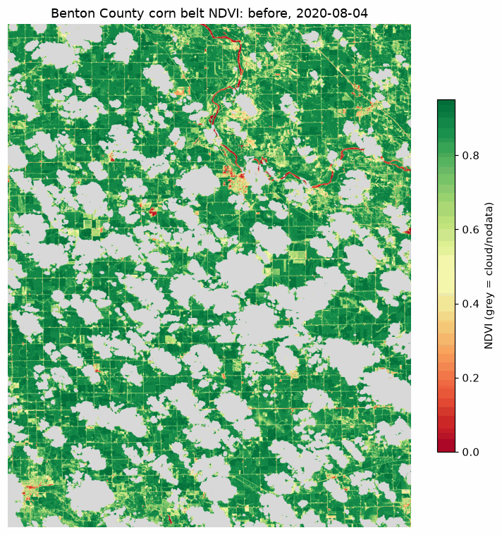
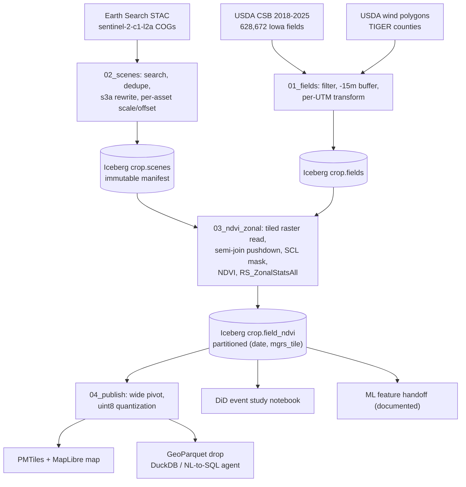

# s2-field-ndvi

**An open field-level crop-stress feed: raw Sentinel-2 pixels become a queryable NDVI
table for every USDA field boundary in Iowa, consumed as a map by humans, as SQL by
analysts and agents, and as features by damage models. Proven by detecting and
quantifying the 2020 derecho against USDA's measured wind data.**

Built end to end on open-source **Apache Spark 3.5 + Apache Sedona 1.9.1 + Apache
Iceberg 1.11**. Runs on a laptop, in Docker/kind, on EC2 spot, and on EKS, from one
codebase and one container image.



*Benton County, Iowa. Left frame 2020-08-04 (six days before the derecho), right frame
2020-08-19 (nine days after). Grey blobs are cloud, masked per pixel. The green-to-
yellow shift across the field grid is the storm plus late-season drought; separating
those two is what the event study below does.*

## The business question

After the 2020-08-10 derecho flattened a swath of Iowa, USDA needed weeks and a GIS
desk to assess field damage. This pipeline answers "which fields lost canopy, and how
badly" for every field boundary in the state, from public satellite data, in one
afternoon of compute that costs a few dollars.

## The headline result

Difference-in-differences estimate of NDVI change attributable to the storm (drought
controlled via matched-latitude unaffected fields), corn fields, Benton County:

| USDA wind band | Fields | NDVI change vs matched controls | Std err |
|---|---|---|---|
| 60-79 mph | 527 | **-0.014** | 0.003 |
| 80-99 mph | 142 | **-0.041** | 0.005 |
| 100+ mph | 116 | **-0.056** | 0.007 |

Damage deepens monotonically with measured wind, after removing what the concurrent
drought did to unaffected fields over the same 15 days. Full analysis with caveats:
[notebooks/derecho_event_study.ipynb](notebooks/derecho_event_study.ipynb).

## Study design

- **Hypothesis**: wind damage from the 2020-08-10 derecho caused corn canopy loss
  detectable as an NDVI decline, and the decline increases monotonically with
  USDA-measured wind speed. Null: after removing the concurrent drought via
  controls, no gradient across wind bands.
- **Identification**: difference-in-differences. Treated fields are corn (CDL 2020)
  inside a USDA wind-gust polygon; controls are corn fields outside every polygon
  within 0.15 deg latitude of each treated field. The August 2020 flash drought
  (US Drought Monitor D1 coverage 34.3% to 60.9% across the window) varies along
  that latitude gradient, so matching nets it out. Per-field effect: (post - pre
  NDVI) minus the mean (post - pre) of its matched controls, requiring at least
  5 controls per field.
- **Inputs**: Sentinel-2 c1-l2a via Earth Search STAC (red/nir/scl assets); USDA
  CSB field boundaries buffered inward 15 m; USDA derecho wind-gust polygons;
  pre scene 2020-08-04 (15.5% cloud), post scene 2020-08-19 (0.5% cloud).
- **Process**: fields and wind zones to Iceberg (01) -> STAC scene manifest (02) ->
  SCL-masked NDVI -> one zonal-stats pass per field with valid_frac (03) -> DiD in
  the notebook, requiring valid_frac >= 0.5 on both dates.
- **Result**: the table above; a monotonic dose-response across all three wind
  bands. Reported as a floor, not a point estimate (see limitations).

All thresholds were pre-registered in `config.yml` before results were computed
and are never tuned against the outcome.

## The map

Interactive PMTiles map (serve locally with `make web-serve`, or the GitHub Pages
deployment once public):

- **Change view**: NDVI change from Aug 4 to Aug 19 per field. Red = loss, white =
  no change, blue = gain. The neutral color is pinned at exactly zero change.
- **Before / After views**: absolute NDVI on each date, red-to-green.
- **Grey fields**: cloud-masked below the validity threshold on either date. The map
  refuses to show a value it cannot stand behind.
- **Hover**: per-field values, crop type, and USDA wind band.

## Definitions (what you are looking at)

- **NDVI**: Normalized Difference Vegetation Index, `(NIR - red) / (NIR + red)` on
  surface reflectance. Dense green canopy reads 0.7-0.9; bare soil near 0.1; water
  negative. It measures greenness, not health directly.
- **Surface reflectance scale/offset**: Sentinel-2 stores reflectance as scaled
  integers. The Sedona read path applies the embedded scale/offset automatically;
  the STAC manifest records them per asset as provenance (see
  [docs/spark-notes.md](docs/spark-notes.md) for the trap this avoids).
- **SCL**: Sentinel-2's Scene Classification Layer. Classes 0, 1, 3, 8, 9, 10, 11
  (nodata, defective, cloud shadow, clouds, cirrus, snow) are masked per pixel before
  any statistic is computed.
- **valid_frac**: the fraction of a field's pixels that survived cloud masking.
  Below 0.5 the field renders grey instead of reporting a number.
- **Field boundary (CSB)**: USDA Crop Sequence Boundaries 2018-2025, modeled from
  eight years of Cropland Data Layer rasters. Boundaries are statistical field
  extents, not surveyed parcels; they are buffered inward 15 m here so edge pixels
  and roadside vegetation do not contaminate field means. Iowa has 628,672 of them;
  7,226 fall inside the demo county.
- **Dekad**: a 10-day compositing window. In season mode the pipeline keeps the best
  (least cloudy) scene per tile per dekad. In event mode it pins exact dates.
- **MGRS tile**: the 110 km military-grid squares Sentinel-2 products ship in.
  Iowa spans 29 tiles across three UTM zones, which is why polygon reprojection is
  explicit per zone in the pipeline.
- **Difference-in-differences (DiD)**: treated fields (inside a USDA wind polygon)
  are compared against control fields (outside every polygon) at matched latitude,
  so statewide drivers like the concurrent drought subtract out. What remains is
  attributable to the storm.
- **PMTiles**: a single-file vector-tile archive read by HTTP range requests. The
  whole interactive map is static files, no tile server, no backend.
- **Iceberg**: the table format under every stage. Partitions on
  `(date, mgrs_tile)` are the unit of work, restart, and scheduled refresh.

## Quickstart (laptop, $0, no cloud account)

Requires: JDK 17 (`brew install openjdk@17`), Python 3.11 via `uv`, ~5 GB disk.

```bash
make setup     # venv + pinned pyspark/sedona stack
make data      # field polygons, wind polygons, county boundaries
make pipeline  # STAC manifest -> NDVI -> zonal stats -> Iceberg  (~15 min)
make web-serve # the map on http://localhost:8137
```

The default scope is one county and the two derecho dates (~0.8 GB streamed).
Scopes scale from there: `SCOPE=mvp` (6 tiles, ~49% of Iowa), `SCOPE=state`
(29 tiles), `SCOPE=history` (adds Landsat back to 1985, planned).

## Architecture



Full diagram with compute targets and data contracts:
[docs/architecture.md](docs/architecture.md). Engineering notes with measured numbers:
[docs/spark-notes.md](docs/spark-notes.md).

## Operations: incremental by construction

Every run re-queries STAC for a trailing window, diffs against the Iceberg manifest
and existing `(date, mgrs_tile)` partitions, and processes only the delta. Turn the
scheduler off for three weeks and the next run catches up with zero special-case
code. The scheduler is therefore interchangeable: a GitHub Actions weekly cron
(`.github/workflows/refresh.yml`) keeps the current-season panel fresh; the same
container runs under EventBridge/Fargate for statewide cadence (documented, default
off). Sedona is the engine inside a run, never the scheduler.

## Measured performance and cost

| Tier | Extent | Wall clock | Cost | Status |
|---|---|---|---|---|
| demo | 1 county, 2 dates | ~7 min pipeline on M4 laptop | $0 | measured |
| mvp | 6 tiles, 2025 season + event pair | ~47 min to final write, then failed | ~$4 spent | 2 failed runs, causes fixed, retry pending |
| state | 29 tiles, 5 seasons | ~3-6 h on small EKS | ~$20-40 | planned |

The two mvp failures were instructive, not wasted: run 4 exposed a cross-scene
raster shuffle (~30GB spill), run 5 a broadcast ceiling (an 838MB task result
the local-mode transport cannot stream). Both root causes and fixes:
[docs/spark-notes.md](docs/spark-notes.md), Cloud-run findings.

Capacity model and the optimization narrative (241 to 207 s/scene, measured):
[docs/spark-notes.md](docs/spark-notes.md).

## Limitations, stated plainly

- Optical NDVI understates lodging: flattened corn stays green for weeks. SAR-based
  studies found deeper damage than NDVI shows. These estimates are a floor.
- The demo county's control pool is thin (74 unaffected corn fields); the DiD
  strengthens at mvp/state scope where controls multiply.
- CSB boundaries are modeled, not surveyed; 2022 imagery is absent from the
  Collection-1 archive (a known global gap, asserted by a data-quality check).
- Cloud, not revisit, limits temporal density: roughly one usable scene per 5-6
  days in an Iowa summer.
- Cloud handling is three-layered and pre-registered: a 20% scene gate at STAC
  query, the per-pixel SCL mask, and the per-field valid_frac >= 0.5 rule (on both
  dates for the event study). Max-value compositing was rejected because picking
  the healthiest-looking date in a window would bias measured damage toward zero;
  gap-filling interpolation was rejected because no consumer needs it and grey-out
  is the honest rendering. Because storms make clouds, the notebook reports
  attrition per wind band, and at demo scope it is real: validity-filter failure
  rises from 30% of corn fields in the control band to 54% in the 100+ mph band.
  If larger scopes show more than ~15% of field-dekads
  masked, the planned response is a per-field best-valid-observation fallback
  (top-2 scenes per dekad, roughly 2x reads), not a looser mask.

## License and data

Code Apache-2.0. All data sources are US public domain (USDA CSB, USDA disaster
analysis, Census TIGER) or free-and-open (Copernicus Sentinel-2 via the AWS Open
Data program). Nothing in this repository requires credentials to reproduce at demo
scope.
