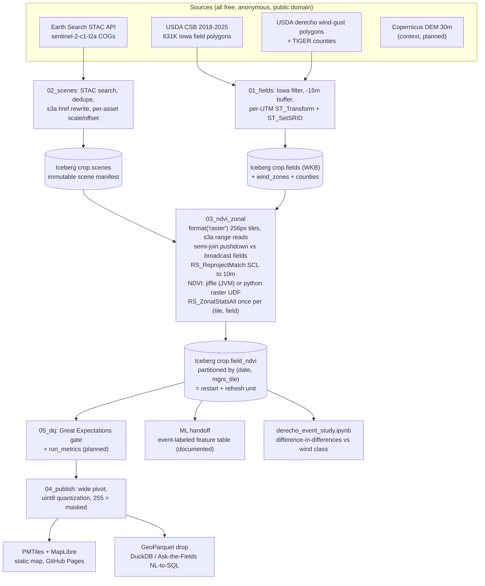

# Architecture

One pipeline, three consumption surfaces. Every stage is open-source Apache Spark +
Apache Sedona; scheduling and compute are interchangeable because runs are idempotent
over (date, mgrs_tile) partitions.

## Compute targets (one image)

| Target | What it proves | Engine |
|---|---|---|
| laptop local[4] | reviewer reproducibility, $0 | jiffle |
| kind + spark-submit | real K8s manifests, $0 | jiffle |
| EC2 spot us-west-2 | state scale, measured $ | jiffle |
| EKS + spark-operator | distributed Spark ops | python_udf vs jiffle benchmark |
| ECS Fargate via OIDC | credential-less scheduled CI runs | jiffle |

## Data contracts

- `crop.scenes`: one row per STAC item; `selected` marks best-per-(tile, dekad)
  (season mode) or best-per-(tile, date) (event mode). The manifest is the
  reproducibility boundary: STAC is live and mutable, this table is not.
- `crop.field_ndvi`: (field_id, date, dekad, season, mgrs_tile, utm_zone, scene_id,
  mean_ndvi, valid_px, total_px, valid_frac). Bands join by scene_id, so cross-date
  stitching is impossible by construction.
- Geometry is WKB in every Iceberg table: Sedona GeometryUDT cannot be written to
  Iceberg on the Spark 3.5 line (native geometry lands with Spark 4.1 + Iceberg v3).
